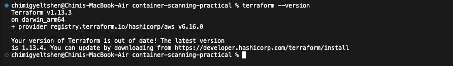
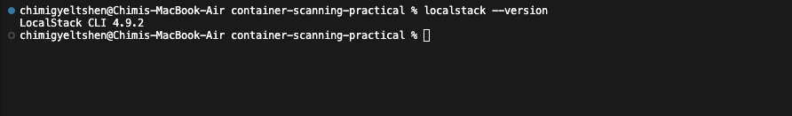
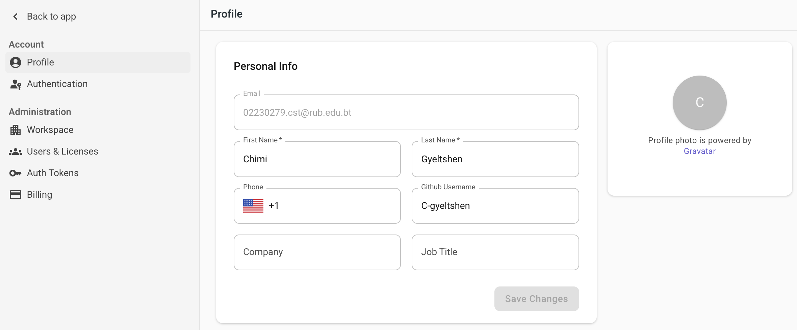
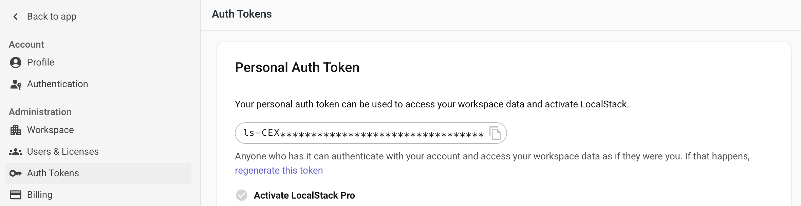
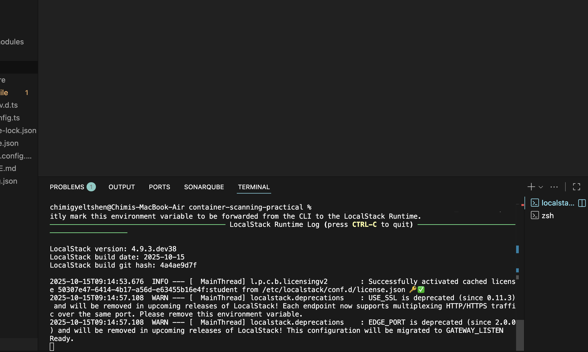
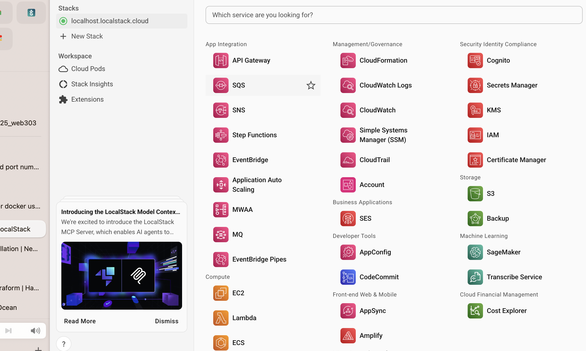
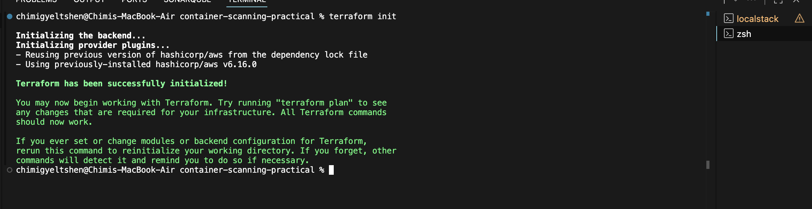
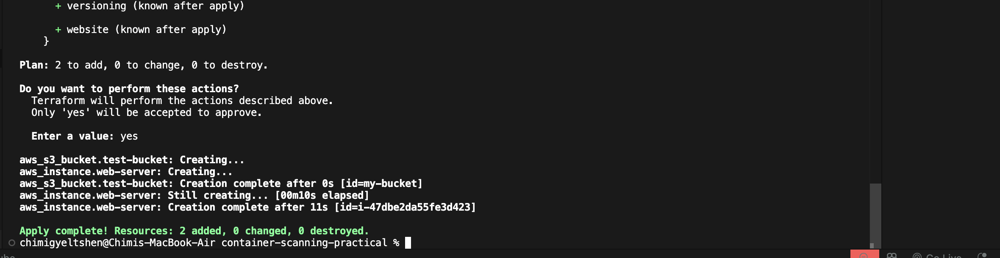
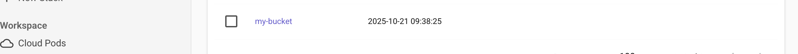
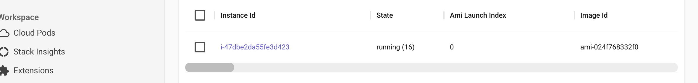

# Infrastructure as Code with Terraform and LocalStack

## [Repository Link](https://github.com/C-gyeltshen/container-scanning.git)

**Learning Outcomes:**
1. Use Terraform to define infrastructure on LocalStack AWS
2. Deploy a basic Next.js starter kit to LocalStack AWS using AWS CodePipeline
3. Use Trivy to test Infrastructure as Code security

**Duration:** 2-3 hours

## Overview

In this practical, you'll learn how to define, deploy, and secure cloud infrastructure using Infrastructure as Code (IaC). You'll use Terraform to provision AWS services locally via LocalStack, build a CI/CD pipeline with AWS CodePipeline, and scan your infrastructure code for security vulnerabilities using Trivy.

### What You'll Build

- **Infrastructure**: S3 buckets, IAM roles, CodePipeline, and CodeBuild using Terraform
- **Application**: A Next.js static website deployed via automated pipeline
- **Security**: Trivy scanning to identify and fix IaC vulnerabilities

### Technologies

- **Terraform**: Infrastructure as Code tool
    
- **LocalStack**: Local AWS cloud emulator
    
- **AWS CodePipeline**: CI/CD orchestration service
- **AWS CodeBuild**: Build service for compiling and testing code
- **Next.js**: React framework for static site generation
- **Trivy**: Security scanner for IaC and containers

## Getting Started

### 1. Initialize a new Nextjs project:

   ```bash
   npx create-next-app@latest my-nextjs-app
   cd my-nextjs-app
   ```

### 2. Containerize the Next.js Application 

   Create a `Dockerfile` in the root of your Next.js project:

   ```Dockerfile
   # Use the official Node.js image as the base image
   FROM node:16-alpine

   # Set the working directory
   WORKDIR /app

   # Copy package.json and package-lock.json
   COPY package*.json ./

   # Install dependencies
   RUN npm install

   # Copy the rest of the application code
   COPY . .

   # Build the Next.js application
   RUN npm run build

   # Expose port 3000
   EXPOSE 3000

   # Start the Next.js application
   CMD ["npm", "start"]
   ```  

### 3. Set Up LocalStack

1. Install LocalStack:

   ```bash
   pip install localstack
   ```

2. Create LocalStack Account:

    

3. Get LocalStack Auth Token:

    

4. Add Auth Token to the project:

    ```bash
    localstack auth set-token <your-auth-token>
    ```

5. Start LocalStack:

    

6. Verify LocalStack is running:

    

### 4. Configure S3 Bucket for Next.js Application

1. Create main.tf file in the project root:

    ```terraform
        resource "aws_s3_bucket" "test-bucket" {
            bucket = "my-bucket"
        }
    ```

2. Apply Terraform configuration:

    ```terraform
    tflocal init
    tflocal apply
    ```
    
    
    

3. Verify S3 Bucket Creation:

    ```terraform
    tflocal init
    tflocal apply
    ```
    
    
    

## Elastic Compute Cloud (EC2)

### 1. Create a key pair

```bash
awslocal ec2 create-key-pair \
    --key-name my-key \
    --query 'KeyMaterial' \
    --output text | tee key.pem
```
### 2. Connecting via SSH

```bash
awslocal ec2 run-instances --key-name my-key ...
```
